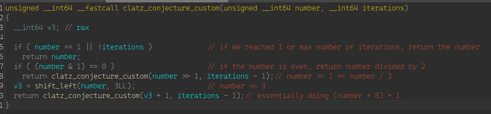

# Magic Number
This is the first medium (200 pt) challenge in the reverse category.


We're given an executable and a netcat host + port to connect to for later on. Opening up the executable, everything looks pretty straight forward except for the start which seems to take in a couple of special cases, but all result in failure. Near the middle, we can see that if we input 50000, we can get to the next step of the puzzle which is actually inputting the magic number:


You'll notice that many of the functions are already labeled, that's because I labeled them beforehand because I don't think the labeling process should be included in the writeup, but I'll explain what each one does:
- win is the win function, it opens flag.txt and outputs its contents
- add_68 just adds 68 to the arg passed to it and returns it
- clatz_conjecture_custom is just the [clatz conjecture](https://en.wikipedia.org/wiki/Collatz_conjecture) but with a couple subtle changes
  - when the number is even, instead of doing n*3+1, it'll do n<<3+1
  - instead of going until it equals 1, it goes until it has done `arg2` iterations or it equals 1
  - heres a screenshot of what the function looks like
  - 

After running all those functions, we can get the win function to run if the final result equals 0x96A878D249249. So to do that, we have to write a script to do that whole process in reverse with our desired number as the starting number. Here's the script I wrote in Ruby to be able to get the correct magic number:

```rb
def reverse_clatz(num, iterations)
    return num if iterations == 0 || num == 1

    # we can't just check if the number is even or odd, so we have to do the operation for the odd number
    # and if that returns a whole number, then we can assume that the previous number was odd
    if ((num - 1.0) / 8.0) % 1 == 0 # this is the reverse of (num*8)+1
        return reverse_clatz((num - 1) >> 3, iterations - 1)
    else
        return reverse_clatz(num << 1, iterations - 1)
    end
end

def reverse_add_68(num)
    # self explanatory as to why we subtract instead of add
    return num - 68
end

num = 0x96A878D249249
num = reverse_clatz(num, 8)
num = reverse_add_68(num)
num = reverse_clatz(num, 4)
num = reverse_add_68(num)
puts "result: #{num}"
```

Running this gives the following output:


Now we can run it on the remote host and get the flag! (don't forget to input 50000 first)


