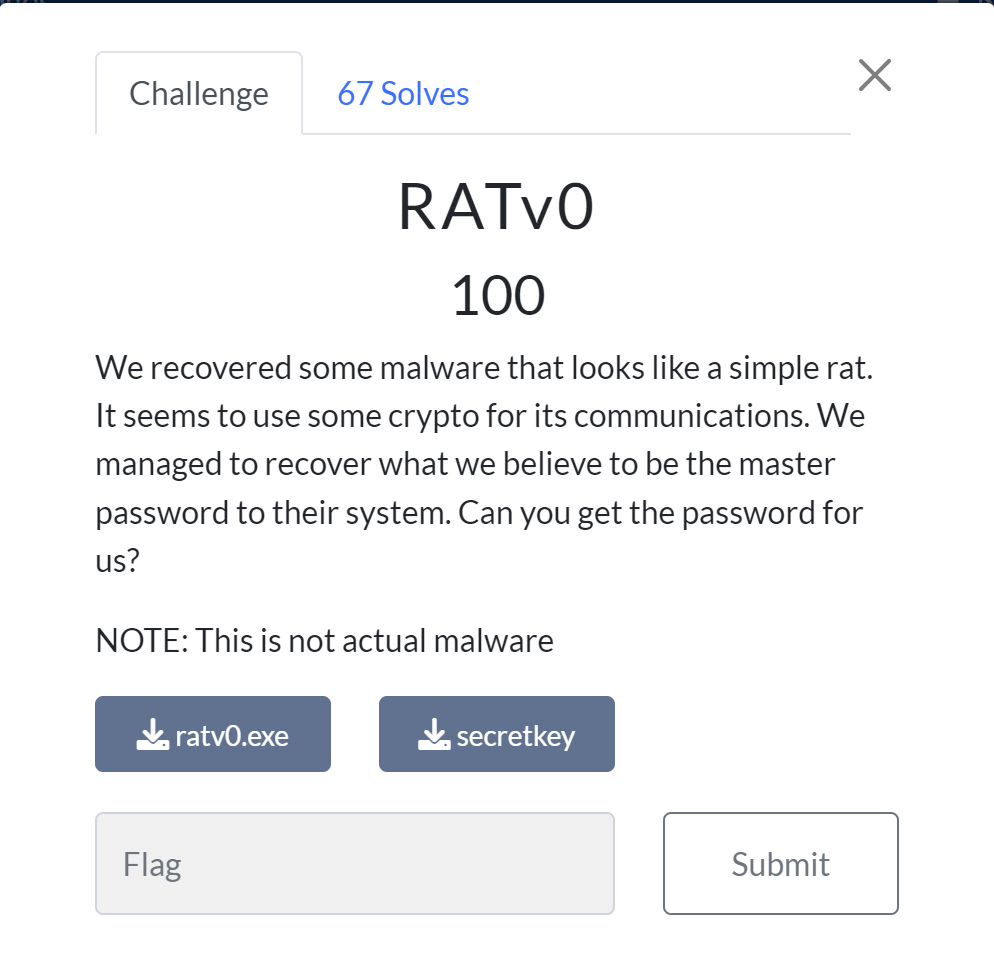

# RATv0
This was the second easy (100 pt) challenge in the reverse category for this CTF. Although it was "easy," it has less solves than both of the medium challenges which I thought was pretty interesting.

We're given an executable file and a secret key file which just contains a bunch of gibberish data. To start, I ran the exe and I got nothing except the following error message

So I figured I had to dive into the binary of the executable to get some information. I won't go too in depth of what happened here because it did stall me for a bit, but what happened was that I wasn't able to find the string for that error message anywhere, and along with that, I was noticing a couple of strings referencing downloading files, so I decided to load up [Procmon](https://learn.microsoft.com/en-us/sysinternals/downloads/procmon) to see if it was downloading anything and to where it was downloading. After setting up the filters and rerunning the exe, I noticed that it indeed was downloading files and storing them into a temp directory.

Since the file path had '.net' in it, I figured that this was a C# dll file, so I went ahead and opened it up in [dnSpy](https://github.com/dnSpy/dnSpy) to see what was going on. After, opening it and filtering through the initialization stuff, I found out that it would just AES decrypt data from a host (the host was down which is why I was getting the error message from the start). Since we were given the encrypted data in the secretkey file, I now had all the pieces to throw the data into cyberchef to get our final output! (key and iv were in the MakeNetworkConnection function, I converted them from byte arrays to hex strings to make them fit the formatting for cyberchef)

