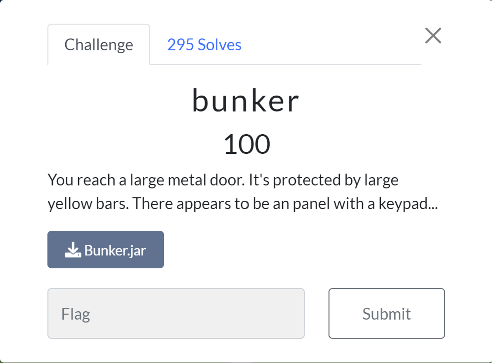
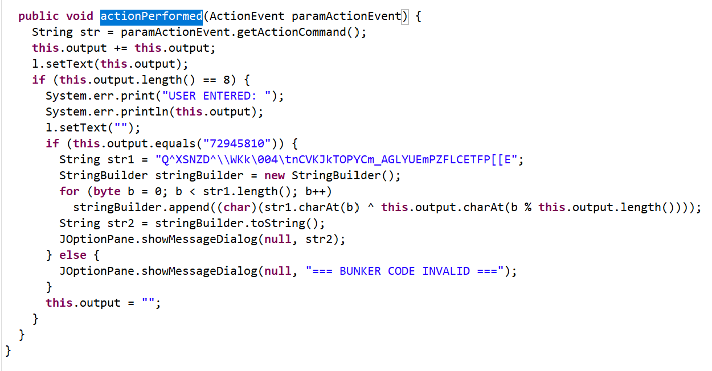
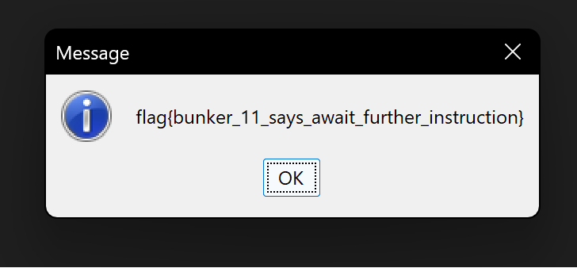

# Bunker
This challenge was the first of the easy (100 pt) challenges in this coop.

We're given a .jar file which means we're working with some Java. Since this was an easy category challenge, I just figured it would have something to do with information found in the source, so I opened up the .jar file in the [Java Decompiler](http://java-decompiler.github.io). Once opened, I found the 'actionPerformed' function which seemed to have exactly what I needed:

From here, we can see that the password is 72945810. To get the flag, we can start the application by running `java -jar bunker.jar`, input the code, and it'll output the flag in a message box.

