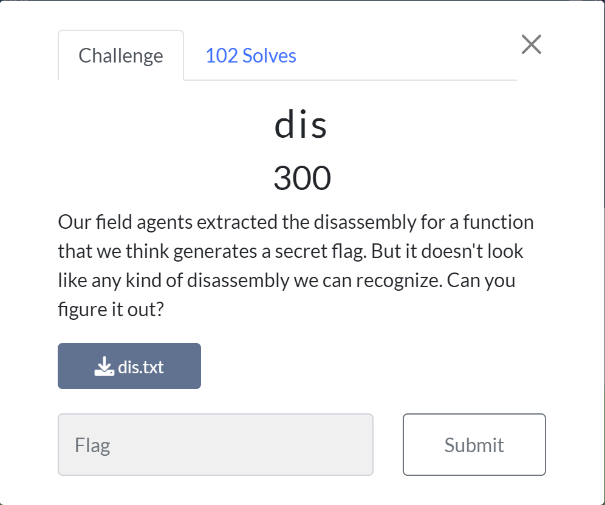
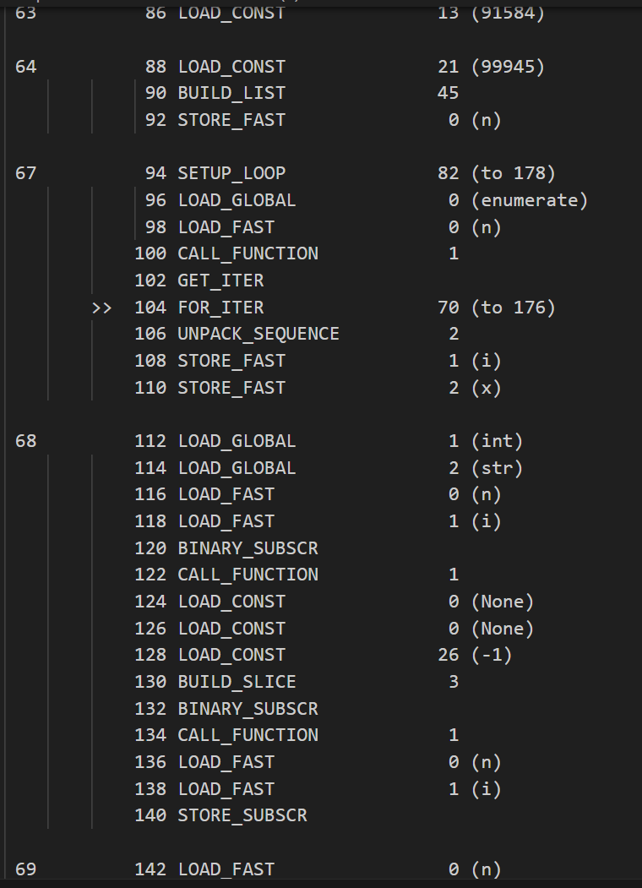
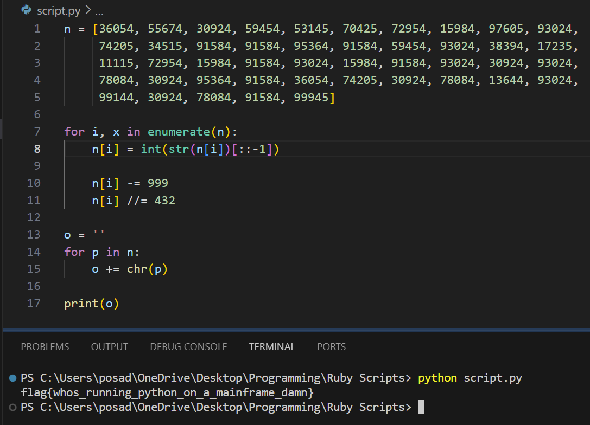

# dis
this was the first hard (300 pt) challenge in the reverse category.

We're given a text file, and upon opening it, it looks like some sort of assembly. After doing some reasearch, I realized that is was python dis-assembly (should've seen that coming considering the challenge name)

Here's an example of a snippet of the assembly:

I'll skip over the boring parts of figuring this out because I tried many python dis to pseudocode converters but none worked for me. Eventually, I gave up and turned to ChatGPT not expecting much. After sending it the dis-assembly and asking it to convert the dis-assembly to python psuedocode, to my surprise, it actually spit out some decent looking psuedocode. It failed on the first go, but after using the regenerate response feature to get a new response, I ran it and was able to get the flag!

