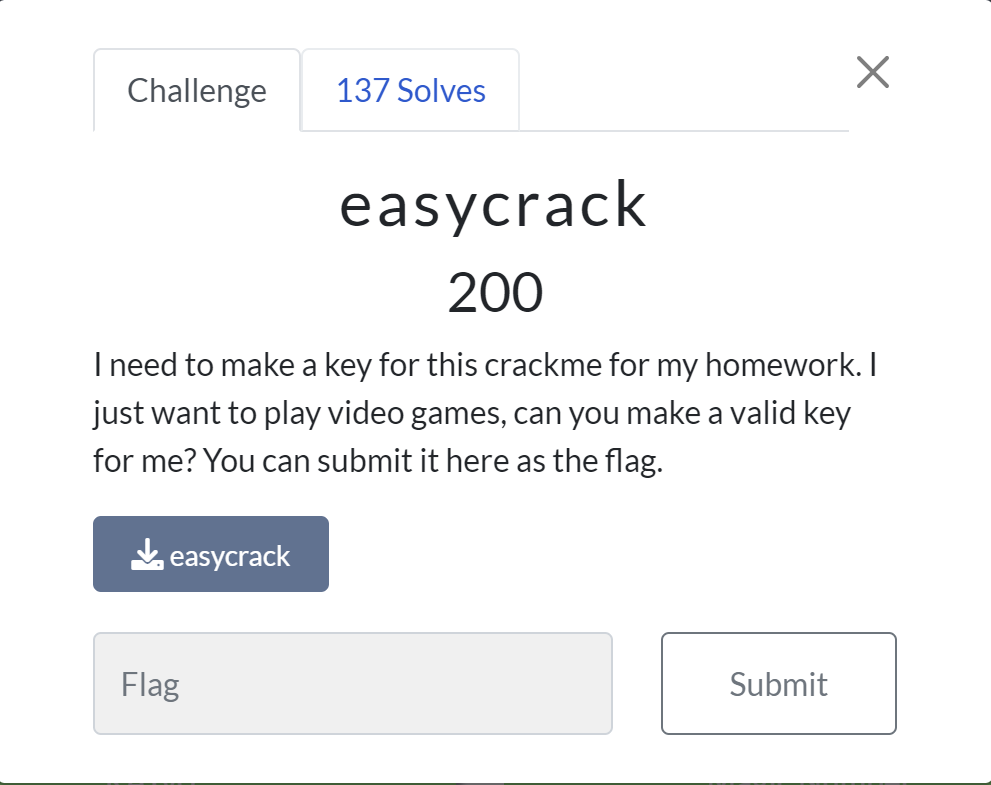
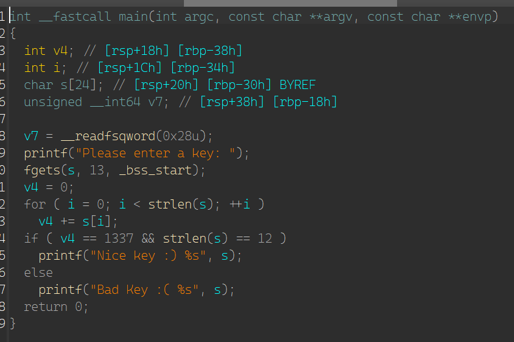
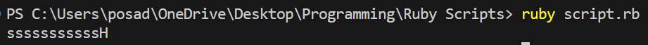
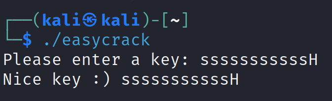

# easycrack
This is the second medium (200 pt) challenge in the reverse category.



For this challenge, we're just given an executable and it's asking for a valid key, so first thing's first I load it up in IDA.



So the name "easycrack" really wasn't lying, a quick glance at this and you can tell that all it wants is an input of 12 characters where the ASCII sum of all the characters equals 1337

You could have easily solved this by hand, but I wrote a simple script to generate a key for this to pass:
```rb
num = 1337
first_char = num / 11 - 6
a = [first_char.chr] * 11
a << (num - first_char * 11).chr
puts a.join
```

And this script output the following string:



From there, let's test the string with the executable:



Got a valid key! The challenge says that it'll accept any valid key as a flag, so that key is the final flag.