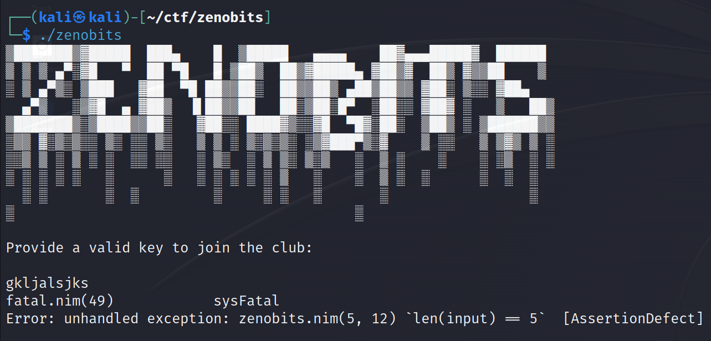

# zenobits
This was the only very hard (500 pt) challenge in the reverse category for this CTF.


We're given a binary and a remote host and port to connect to for later on. I'm not going to lie, this challenge took me a while to piece together and would be rough to give a full rundown in text, so I'm going to have to skip over a few of the finer details and get straight into the sauce.

Running the binary, we can see it asks for a valid key. Throwing in some random garbage, we can actually see that it prints some debug output which we don't see too often with these challenges. We can also see that this was written in nim, but that's not going to help us much with solving this.



From there, I put the binary into IDA to begin analyzing. This is the part where I'm going to have to skip a few of the finer details and get straight into the juicy stuff, because there was a lot of stuff I had to filter through before finding the function that contained all the important data. This function is the main function that parses your input and runs a series of checks to see if your input is valid.


To begin, the function takes in a pointer to a nim string object, which looks something along the lines of:
```c
struct nim_string {
    __int64 len;
    __int64 unk;
    char data[len];
}
```
Yes I know this isn't a valid struct because len has to be defined at compile time, but you get the idea. Next, the parse_input function will split your input by each '-' character (imagine running "a-b-c-d".Split('-') in python), and return a pointer to a struct that looks something along the lines of
```c
struct parsed {
    __int64 len;
    __int64 unk;
    nim_string* data[4];
}
```
with data being each of the strings that were split (and converted to `nim_string`s).
From here, it's been established that the input needs to be 4 different strings all joined together by `-`s. Now the actual important part of this function is the rules, in the psuedocode screenshot, you'll see 4 "rule" functions with each one having its own purpose.

One general rule that stays true throughout this is that each string must be exactly 5 characters long, so keep that in mind.

**--- Rule 1 ---**

The first rule is that the first string must contain digits that when summed together equals 28. An example string would be "99910" because 9+9+9+1+0 equals 28. "77077", "45676", and "33499" are also valid examples.


**--- Rule 2 ---**

The second rule is that the difference between each neighboring ASCII value in the second string must be 5 and the string must be sorted. For example, the string "AFKPU" would work because when mapping out the ASCII value of each character, we get [65 70 75 80 85]. As you can see, the difference between each of the neighboring values in this list is 5, and the list is sorted.


**--- Rule 3 ---**

This one is much simpler, take your string and split the 5 characters as so (a `|` represents a split): `xx|x|xx`

Every character in this string must be a digit, so take the following input, "54351", and split it into "54", "3", and "51". From there, convert each substring into an integer, and add the last number and the middle number together. If the sum equals the first number, then you've got a valid input. In the example I gave, "54351" was a valid input because adding 51 and 3 gives us 54. More examples of valid inputs for this rule would be "30327", "71962", and "14113".


**--- Rule 4 ---**

This one was a bit weirder, and would be easier to explain using python psuedocode because this would be a lot to write out
```py
# the string is valid if the following are true

data = 'xxxxx' # 5 character string input here
assert data[0] % 10 == 0
assert data[1] % 4 == 0
assert data[2] % 2 == 0
assert data[3] % 5 == 0
assert data[4] % 9 == 0
```
A valid input for this would be "PxvFc"

Now that we've got all the rules covered, we can take all the example valid inputs I gave and join them with `-`s to get a key that looks like `99910-AFKPU-54351-PxvFc`. Running the local binary, we can see that it's a valid key, but it gives us a warning about what to expect from the remote binary:


I'll save you the trouble of figuring this out, but it'll ask you for 50 unique and valid keys before giving you the flag, so I put together a script using pwntools to automate the key generation and key sending process for me. I'm not the best at python so it's a bit sloppy, but it works:
```py
#!/usr/bin/env python3
from pwn import *
import random
import string

def get_rule_1():
	a=random.randint(1, 9)
	b=random.randint(1, 9)
	s=a+b
	ret=str(a)+str(b)
	for _ in range(3):
		s+=9
		r="9"
		if s>28:
			r=str(9-s+28)
			s=28
		ret+=r
	return ret

def get_rule_2():
	if random.randint(0,1) == 0:
		start=random.randint(97,102)
	else:
		start=random.randint(65,70)

	ret = ""
	for i in range(5):
		ret += chr(start + i*5)
	return ret

def get_rule_3():
	a=random.randint(10,90)
	b=random.randint(1,9)
	return f"{a+b}{b}{a}"

def get_rule_4():
	a=[c for c in string.ascii_uppercase+string.ascii_lowercase if ord(c)%10 == 0]
	b=[c for c in string.ascii_uppercase+string.ascii_lowercase if ord(c)%4 == 0]
	c=[c for c in string.ascii_uppercase+string.ascii_lowercase if ord(c)%2 == 0]
	d=[c for c in string.ascii_uppercase+string.ascii_lowercase if ord(c)%5 == 0]
	e=[c for c in string.ascii_uppercase+string.ascii_lowercase if ord(c)%9 == 0]
	return random.choice(a)+random.choice(b)+random.choice(c)+random.choice(d)+random.choice(e)

p = remote('0.cloud.chals.io', 21019)
context.log_level = "DEBUG"

p.recvuntil(b"club:\n\n")
p.sendline(b"99811-AFKPU-54252-FDBAH") # random first key

try:
	while True:
		r = p.recvuntil(b"key.\n", timeout=10)
		if r == '': break
		key = "-".join([get_rule_1(), get_rule_2(), get_rule_3(), get_rule_4()]).encode()
		p.sendline(key)
except:
	print(p.recv())

p.close()
```

Running this script, it'll eventually break and print the flag like so:

